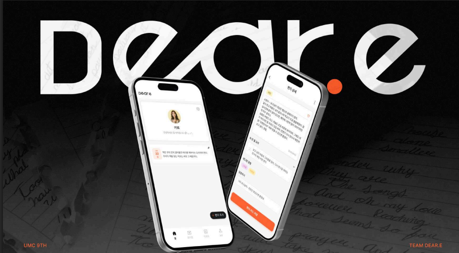
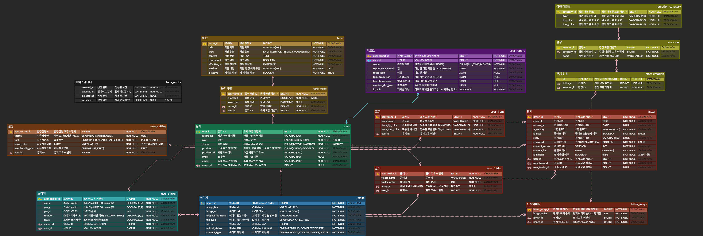
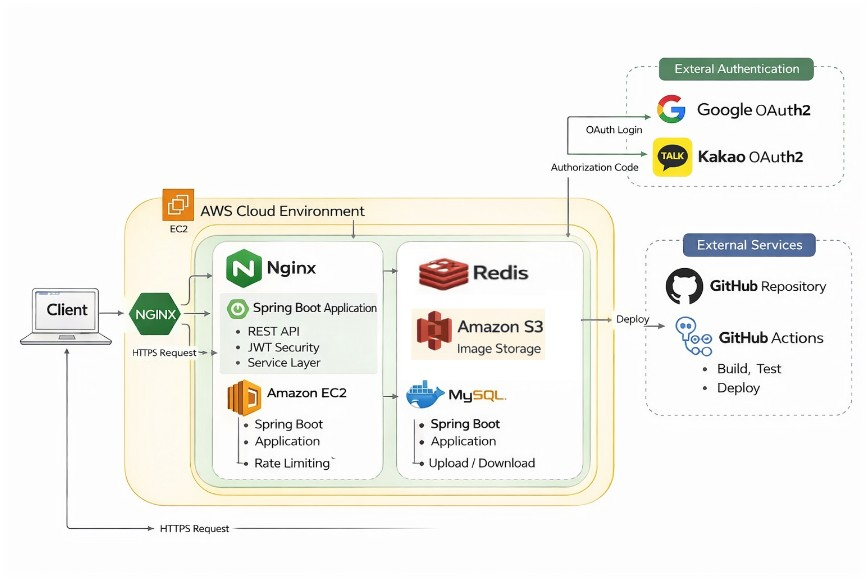

Dear.e Back-end Repository 💌
---
"소중한 진심들이 잊히지 않도록, **편지 아카이빙** 서비스"
 
**디어리**의 백엔드 저장소입니다.
 

 

---
## ✨ 핵심 기능

### 🔐 인증 및 회원 관리
- **OAuth 기반 소셜 로그인/회원가입 구현**
    - Google, Kakao 간편 로그인 지원
- **JWT 기반 인증 구조**
    - Access Token / Refresh Token 이중 토큰 방식 적용
    - 자동 로그인 및 보안성 강화

### 🤖 AI 기반 편지 분석
- **OCR 기반 텍스트 추출**
    - 편지 이미지 업로드 시 내부 편지글 자동 인식 및 텍스트화
- **AI 감정 분석 및 요약**
    - 편지 내용 한줄 요약 생성
    - 감정 태그 자동 추출

### 💌 편지 관리 기능
- **From 기반 편지 관리**
    - 발신자(From) 추가 및 선택
    - 발신자별 편지 조회 기능 제공
- **편지 수정 및 기록 관리**
    - 편지 내용 수정 가능
    - 답장 기록 저장 및 관리
- **폴더 기반 정리**
    - 폴더 생성 및 편지 분류
- **편지 검색 기능**
    - 키워드 기반 편지 검색 지원

### 🎲 랜덤 편지 카드
- **오늘의 랜덤 편지 제공**
    - 하루에 한 번 랜덤 편지를 홈 화면에 표시
- **본문 랜덤 문장 추출**
    - 편지 내용 중 일부 문장을 랜덤 카드 형태로 제공

### 🏠 홈 화면 커스터마이징
- **UI 개인화 기능**
    - 배경색 변경
    - 스티커 배치 및 커스터마이징 가능

### 👥 마이페이지
- **프로필 관리**
    - 사용자 정보 수정
- **From 관리**
    - 발신자 목록 추가/수정/삭제
- **스타일 설정**
    - 폰트 변경 등 개인화 설정 지원

---

## ⚙ 기술 스택
|    파트    |                                기술                                 |
|:--------:|:-----------------------------------------------------------------:|
| BackEnd  | Java17, SpringBoot, SpringSecurity, JPA, OAuth, JWT, Spring Cloud |
| DataBase |                           MySQL, Redis                            |
|  Infra   |                      Docker, AWS EC2, AWS S3                      |
|   etc.   |                     Swagger, Notion, Discord                      |

---

## 💁‍♂️ 프로젝트 팀원

<table>
<tr>
<td align="center" style="width: 150px; padding: 10px;">
 
<b>이은우</b> 
편지함 관리, 편지 관리, 폴더 관리
</td>
<td align="center" style="width: 150px; padding: 10px;">
 
<b>김동국</b> 
회원가입/로그인, 계정 관리
</td>

<td align="center" style="width: 150px; padding: 10px;">
 
<b>하지명</b> 
AI 분석 및 감정 태그 관리, 리포트
</td>

<td align="center" style="width: 150px; padding: 10px;">
 
<b>최현진</b> 
OCR 분석, 랜덤 편지/편지글 추출, 프로필 관리
</td>
<td align="center" style="width: 150px; padding: 10px;">
 
<b>권민수</b> 
편지 추가, 홈화면, From 관리, 이미지(s3) 관리
</td>
</tr>
</table>

---
## 🧺 ETC.
### ERD 구조

 

### 아키텍처

 

### 설계 원칙
도메인형 패키지 구조를 기반으로, 비즈니스 로직과 핵심 데이터 패키지를 분리한 구조입니다. 
[컨벤션 정리](https://nostalgic-crib-0d2.notion.site/2bd1829bd7ed81baa825dd5426df1353)

